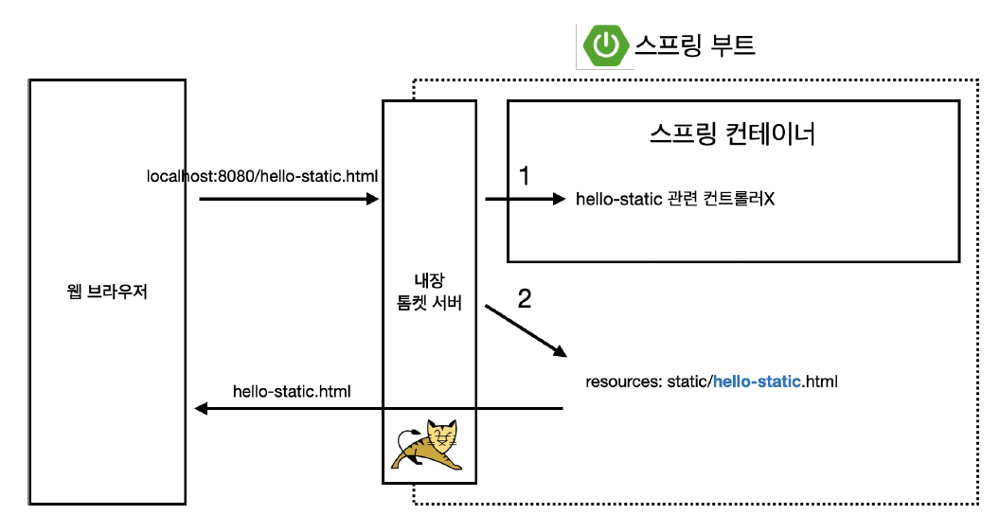
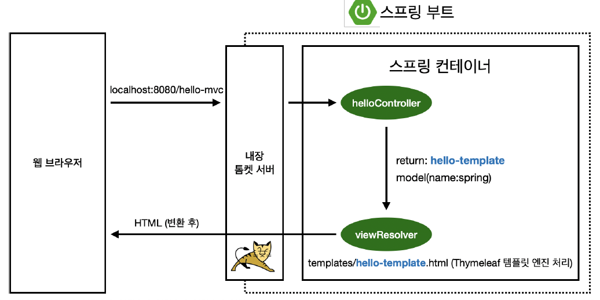
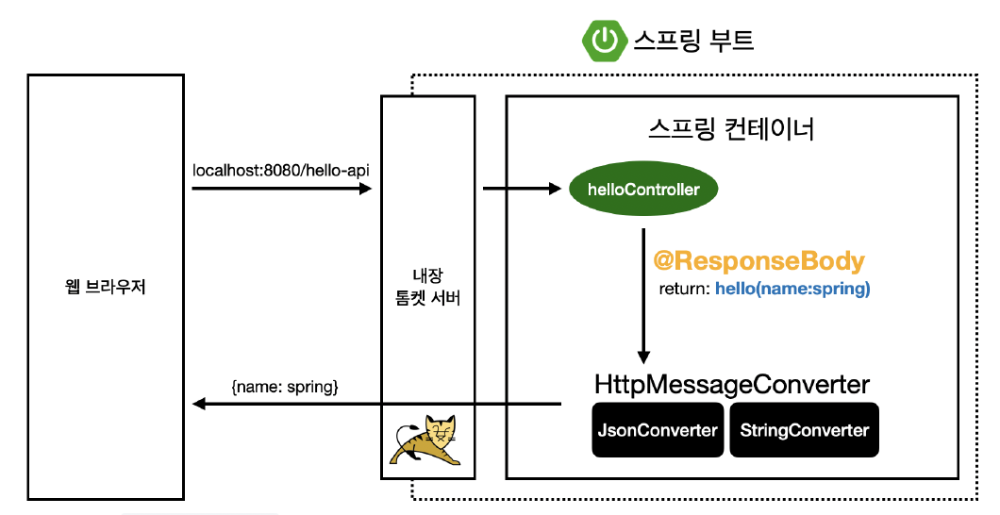

```Disclaimer : 복습 내용이므로, 간단하게 정리```

### 스프링 제공 컨텐츠
- 정적 컨텐츠
  - {: width="400px"}
- MVC와 템플릿 엔진
  - Model, View, Controller
  - {: width="400px"}
- API
  - @ResponseBody를 사용하면 뷰리졸버를 사용하지 않음
  - 대신, http의 바디에 문자 내용을 직접 반환!
  - @ResponseBody 원리
  - {: width="400px"}